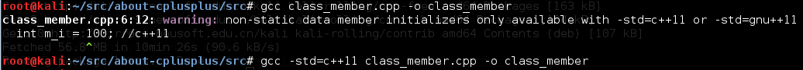

#有关C++

---

##基本语法

- 类
	- 使用class和struct定义类唯一的区别就是默认的**访问权限**
	- 如何创建对象
		- 默认构造函数
		- 自定义构造函数
		- 拷贝函数
		- 赋值函数（vs 拷贝函数）
	- explicit指定符
		
        指定构造函数或转换函数不允许隐身转换或复制初始化

    - 成员对象初始化顺序，**与声明顺序有关，与初始化列表顺序无关**

## C++ I/O

- 标准输入输出流，控制台流I/O
	- 可以直接使用的，内置对象cin、cout、cerr、clog

- 文件流I/O，ifstream、ofstream、fstream
	- ::open
		- mode打开模式
			- ios::in 为输入(读)而打开文件
			- ios::out 为输出(写)而打开文件
			- ios::ate 初始位置：文件尾
			- ios::app 所有输出附加在文件末尾
			- ios::trunc 如果文件已存在则先删除该文件
			- ios::binary 二进制方式
		- 返回void，文件数据存放在filebuf中

- 字符串流I/O

- 例子
		
		ifstream cin("input.txt");
		ofstream cout("output.txt");  
		string line;
		if (cin.is_open()) {
			while(getline(cin, line)){
				cout << line << endl;
			}
		}

## C++ Strings

## C++11部分

- 类内初始值
		
        class Test_Class_Member{
		public:
			int m_i = 100; //c++11
		};
		
		int main()
		{
			Test_Class_Member();
			return 0;
		}

	

- 列表初始化
- auto自动推导（vs Python）
- for语句（vs Python）
- 右值引用
- 新增指针类型
- C++11中的多线程（vs Boost）
- 函数式编程（vs Python）

##C++书籍及资源
- C++的设计与演化
- C++沉思录
- Exceptional C++
- More Exceptional C++
- Advanced C++
- Modern C++
- Modern C++ Design
- C++ Templates
- Effective C++
- More Effective C++
- Effective STL
- Effective Modern C++
- Essential C++
- More C++ Idioms
- Efficient C++，提高C++性能的编程技术 
- 深入理解c++11
- http://en.cppreference.com/w/
- https://github.com/wuye9036/CppTemplateTutorial，C++ Template 进阶指南
- http://gcc.godbolt.org/，在线编译器
- https://github.com/fffaraz/awesome-cpp，C++资源及项目