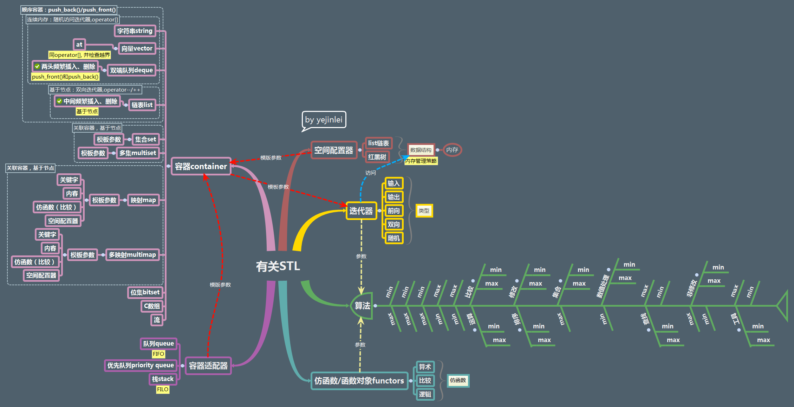

# 有关STL

## 说明
- STL提供主要三种类型的组件:容器\迭代器\算法
- 容器主要有两类:顺序容器\关联容器
    - 顺序容器:vector\list\deque\stringooo等
        - vector:
            - 创建对象\创建对象并预留一定的容量(指定分配大小,提升效率)\创建对象预留容量并初始化(通过new创建元素并放入vector时,要注意防止内存泄漏)
                explicit vector ( const Allocator& = Allocator() ); //使用默认空间配置器创建容器对象 
                
                explicit vector ( size_type n, const T& value= T(), const Allocator& = Allocator() ); //创建容器并预留容量,还可以指定元素的值

                template <class InputIterator>
                vector ( InputIterator first, InputIterator last, const Allocator& = Allocator() ); //通过迭代器拷贝元素

                vector ( const vector<T,Allocator>& x ); //使用其他vector创建对象

                vector<int> v;
                for(int i=1; i<=1000;i++) v.push_back(i) //反例,没有事先预留容量或没有reserve调整容量会造成2~2的10次(1000约等于)方重新分配,效率低下
 
            - 访问数据:通过下标访问类似数组(注意下标越界)\通过迭代器访问(注意迭代失效情况)
            - 存储数据:insert任意位置插入(需要参数为迭代器+偏移位置;之前保存的迭代器可能会失效,并且插入位置后面元素会移动,也会导致效率低下);push_back从后面插入元素
            - 删除数据:erase删除迭代其指定一个元素或区分元素;clear一次性删除所有元素
            - 容器大小:size已包含元素个数;capacity总共可容纳元素个数,即容量(在下一次重新分配之前的大小);resize调整容器元素个数为n(对数据元素具有破坏性,n<size后面元素被截断销毁,n>size会默认构造元素放入容器,n>capacity容量,同时还会重新分配);reserve调整容器的容量(区别与resize,不对数据元素造成破坏,n<capacity被忽略,n>capacity会导致重新分配)
    
    - 关联容器:set\multiset\map\multimap 

- 算法包含四类:排序算法\不可变序算法\变序算法\数值算法

